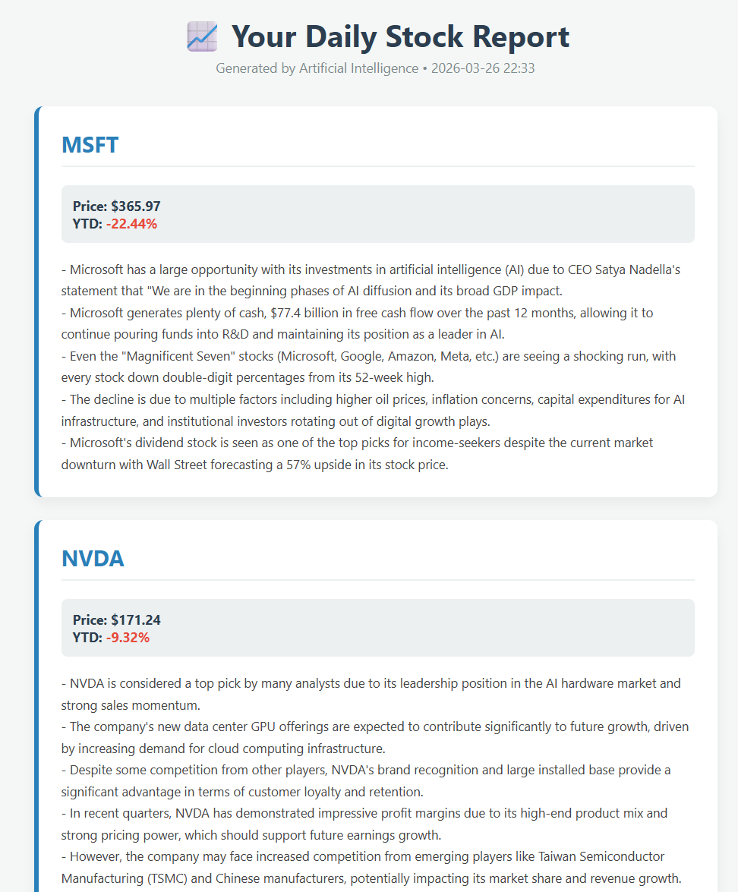

# 📈 AI-Powered Financial Portfolio Analyzer

An automated, local AI agent system that acts as a Senior Equity Research Analyst. It fetches real-time stock data, scrapes the latest news, and uses a local Large Language Model (LLM) to generate a formatted HTML briefing for a chosen portfolio of stocks.

## Architecture & Tech Stack

This project leverages the **Map-Reduce** pattern using multiple AI agents to prevent context-window overflow and ensure high accuracy:
1. **News Reader Agent:** Scrapes and reads full daily articles, extracting key bullet points.
2. **Chief Analyst Agent:** Takes the synthesized notes and current market metrics to write a final, 5-point professional summary.

* **Framework:** [CrewAI](https://github.com/joaomdmoura/crewai)
* **LLM Engine:** Local Llama 3.1 via [Ollama](https://ollama.com/) (100% private, runs on local GPU)
* **Data Sources:** Yahoo Finance RSS, `yfinance`, `BeautifulSoup4` for web scraping.
* **Infrastructure:** Docker & Docker Compose (with NVIDIA Container Toolkit for GPU acceleration).

## How to Run (Locally)

### Prerequisites
* Docker & Docker Compose
* NVIDIA Container Toolkit (for GPU acceleration)
* Ollama running locally with the `llama3.1` model downloaded (`ollama run llama3.1`)

### Setup
1. Clone this repository.
2. Ensure Docker is running and Ollama is accessible on port `11434`.
3. Build and start the environment:
    docker-compose up -d
4. Run the analysis script:
    docker exec -it finance_agent python agent.py
5. Open the generated raport_portfolio.html in your browser to read the briefing!

Disclaimer: This is an educational project. AI-generated financial summaries should not be used as professional investment advice.